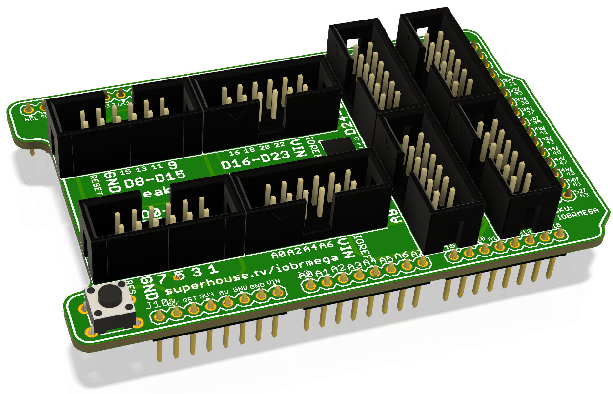

I/O Breakout Shield (Mega)
==========================
Copyright 2017 SuperHouse Automation Pty Ltd  
SuperHouse site:  <www.superhouse.tv>  

Breaks out sets of I/O pins to 2x6 pin headers.

Features:

 * 8 x 2x6 shrouded pin headers
 * Each header provides 8 x data lines, GND, VIN, IOREF, and RESET

More information is available at:

  http://www.superhouse.tv/iobrmega

INSTALLATION
------------
The design is saved as an EAGLE project. EAGLE PCB design software is
available from www.cadsoftusa.com free for non-commercial use. To use
this project download it and place the directory containing these files
into the "eagle" directory on your computer. Then open EAGLE and
navigate to the project.

DISTRIBUTION
------------
The specific terms of distribution of this project are governed by the
license referenced below.

LICENSE
-------
Licensed under the TAPR Open Hardware License (www.tapr.org/OHL).
The "license" folder within this repository also contains a copy of
this license in plain text format.
